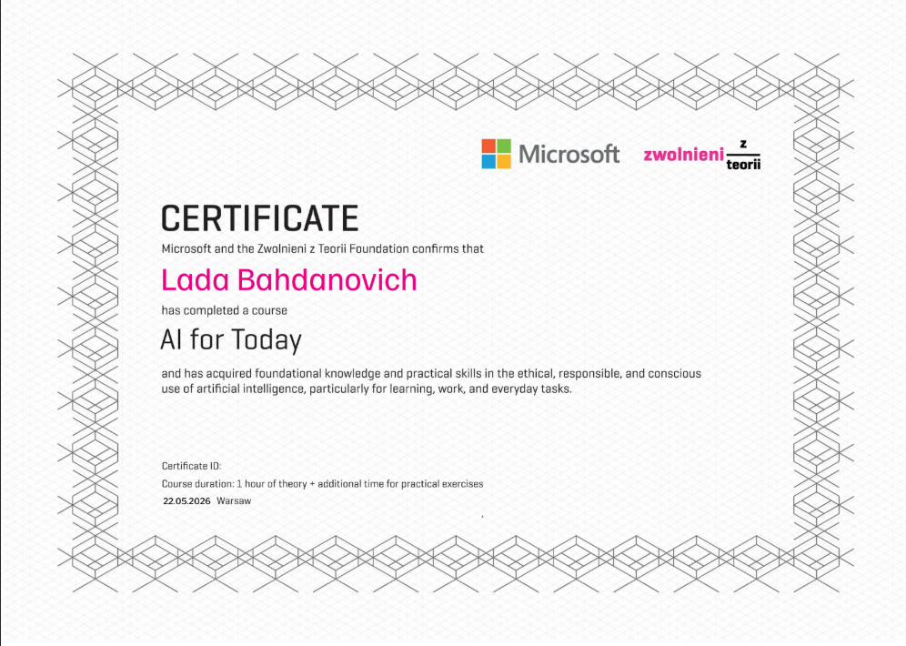
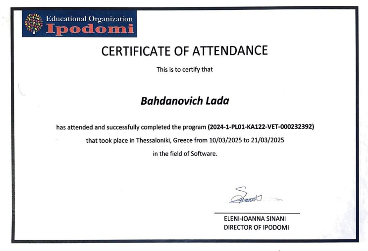

**Junior Python Developer & Data Science Enthusiast** | 📍 Kraków  
💡 Passionate about **backend development** & **data-driven solutions**  

---

## 💻 Tech Stack

**🤖 Machine Learning & MLOps**  

**🗄️ Databases & Data Science**  

 
 
 
 
 
 
  

**🐍 Python & Backend**  

 
 
 
 
  

**⚙️ DevOps & Tools**  

 
 
 
  

**🌐 Web & Frontend**  

 
 
  

**🐳 Containers & Environment**

**🧪 Testing**

**📊 Visualization**

---

## 🎓 AI, Python & Data Science Development Certificate

Over 204 academic hours, I worked with Python fundamentals, OOP, algorithms, and practical projects, and earned a Microsoft AI certification. I also successfully completed my Erasmus+ internship program in Thessaloniki, Greece, where I developed my software skills and gained valuable international and teamwork experience.

  <table>
    <tr>
      <td align="center">
         
        <b>Certificate 1</b>
      </td>
      <td align="center">
         
        <b>Certificate 2</b>
      </td>
      <td align="center">
         
        <b>Certificate 3</b>
      </td>
    </tr>
  </table>

